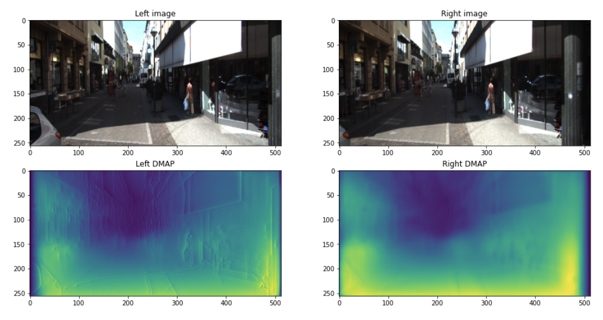

# Self Supervised Monocolar Depth Estimation

Charles Zhang University of Waterloo CS484 (Computer Vision) Final Project

As with semantic segmentation problems, lack of readily available accurate ground truth is a serious hinderance to the applocation of deep learning to monocular depth estimation. This notebook contains an implementation in PyTorch of the monocular depth estimation network proposed by Godard et. al in their 2017 paper titled "Unsupervised Monocular Depth Estimation with Left-Right Consistency" (https://arxiv.org/pdf/1609.03677v3.pdf (https://arxiv.org/pdf/1609.03677v3.pdf)). The official repository, dubbed "Monodepth" was referenced in creating this notebook. https://github.com/mrharicot/monodepth (https://github.com/mrharicot/monodepth)

This notebook aims to clearly explain and demonstrate for learning purposes how Godard et al's proposed depth estimation network functions.

Results after 10 epochs of training using a small subset of the KITTI dataset (5268 left/right image pairs). Performance can be significantly improved by training for much longer on the entire dataset.



## Getting Started

Requirements:
- pytorch
- torchvision
- numpy
- matplotlib
- PIL

If you want to run the notebook, I would recommend using a deep learning docker image such as **Deepo** https://github.com/ufoym/deepo

```bash
docker run              \
    -v $(pwd):/root     \
    --gpus all          \
    -it -p 8888:8888    \
    --ipc=host          \
    ufoym/deepo \
    jupyter notebook --no-browser --ip=0.0.0.0 --allow-root --NotebookApp.token= --notebook-dir='/root'
```